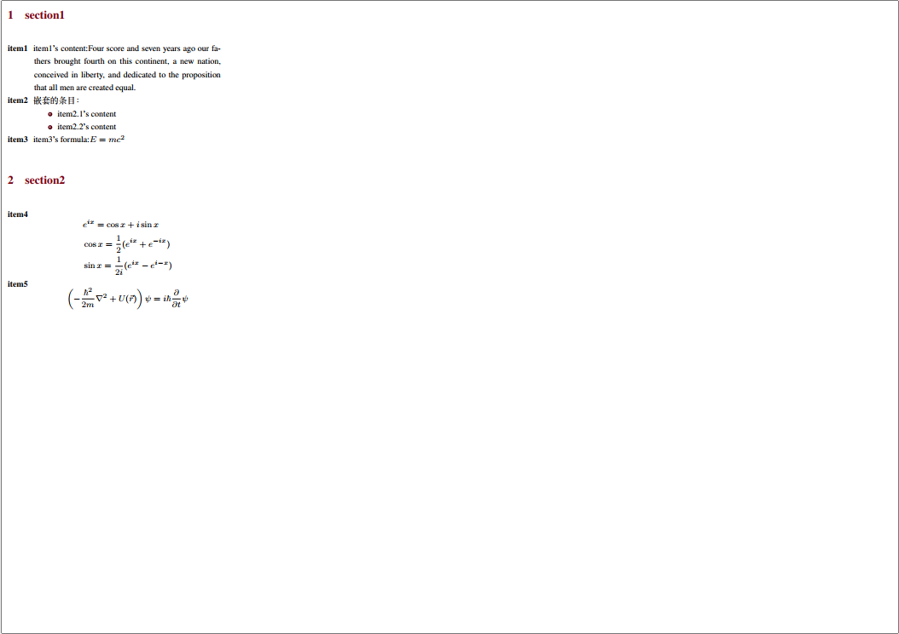

# Cheatsheet-Template
A biref template for exam-oriented-cheatsheet.
This template was originally made by former students in THU-EE, for study only.

### Demo
```tex
\begin{document}
\begin{multicols*}{4}       % column数量
 % 基本结构
\section{section1}          % 开启一个章节
\begin{description}
    \item[item1]{item1's content:Four score and seven years ago our fathers brought fourth on this continent, a new nation, conceived in liberty, and dedicated to the proposition that all men are created equal.}       % 插入一个内容条目
    \item[item2]                        % 一个内容条目下可以继续嵌套条目
    嵌套的条目：
        \begin{itemize}
            \item item2.1's content
            \item item2.2's content
        \end{itemize}
    \item[item3]{item3's formula:$E=mc^2$}  % 行内公式

\end{description}

\section{section2}
\begin{description}
    \item[item4]
    \begin{equation*}           % 插入大段公式
        \begin{aligned}
            &e^{ix} = \cos x + i\sin x\\
            &\cos x = \frac{1}{2}(e^{ix}+e^{-ix})\\
            &\sin x = \frac{1}{2i}(e^{ix}-e^{i-x})
        \end{aligned}
    \end{equation*}
    \item[item5]
    \begin{equation*}
        \left(-\frac{\hbar^2}{2m}\nabla^2+U(\vec r)\right)\psi = i\hbar\frac{\partial}{\partial t}\psi
    \end{equation*}

\end{description}


\end{multicols*}
\end{document}
```
Result:




### Notice
+ Choose XeLatex as compiler
+ You will easily get on the way with a brief glance at the demo code in example.tex.  
+ example.tex is your workplace, DO NOT edit the .cls file unless you know what you're doing.

